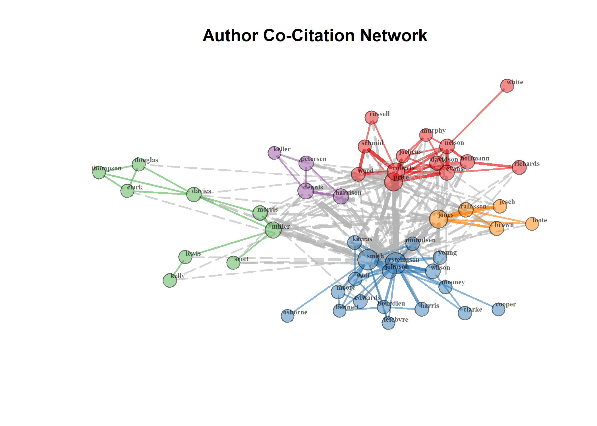
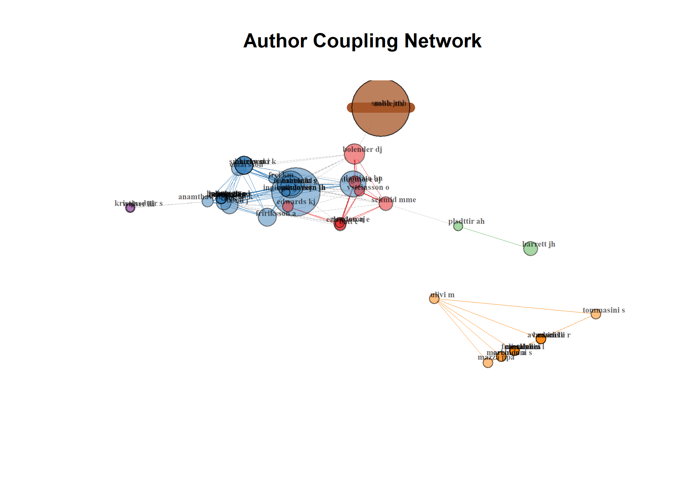
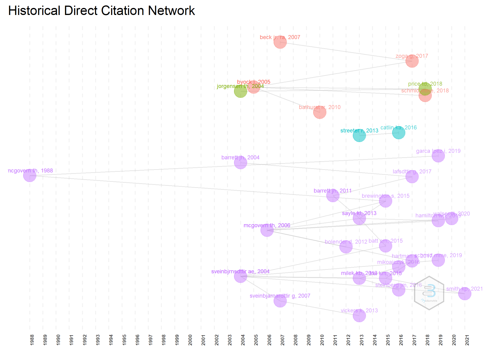
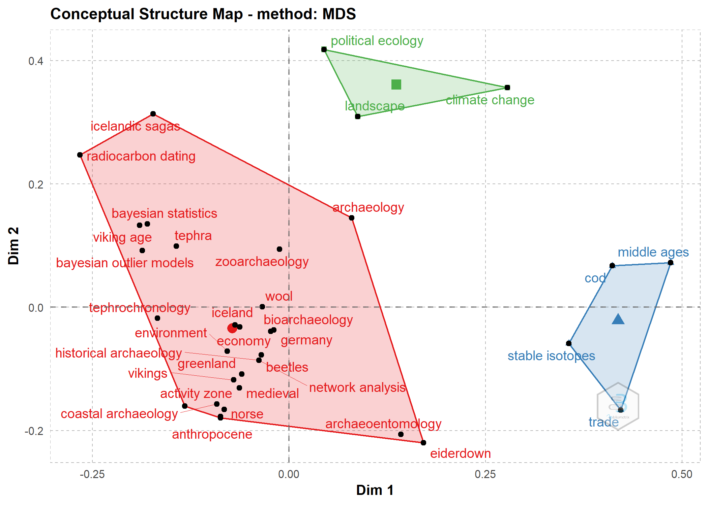
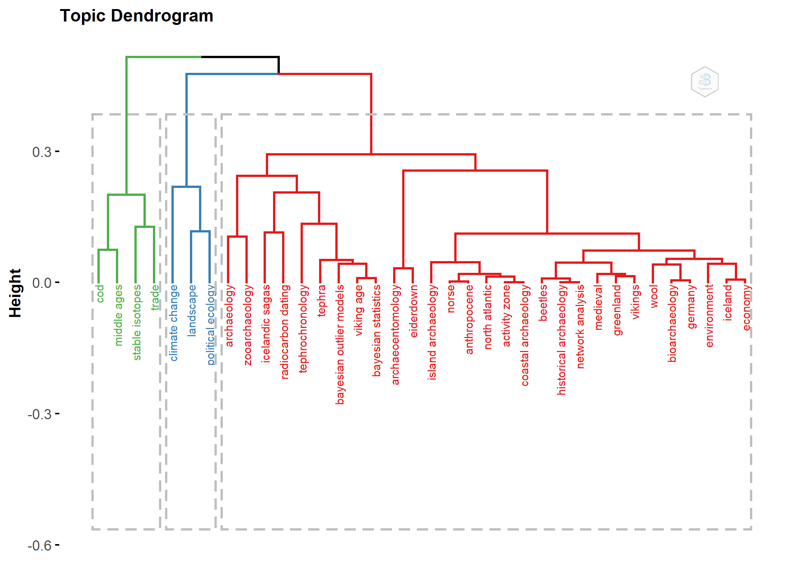
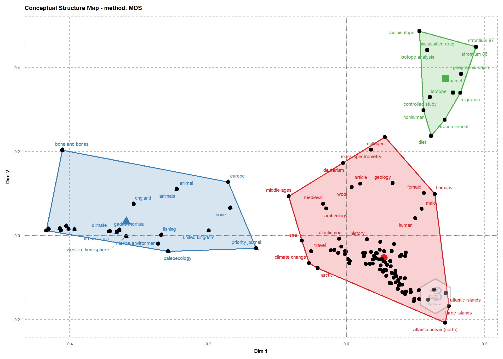
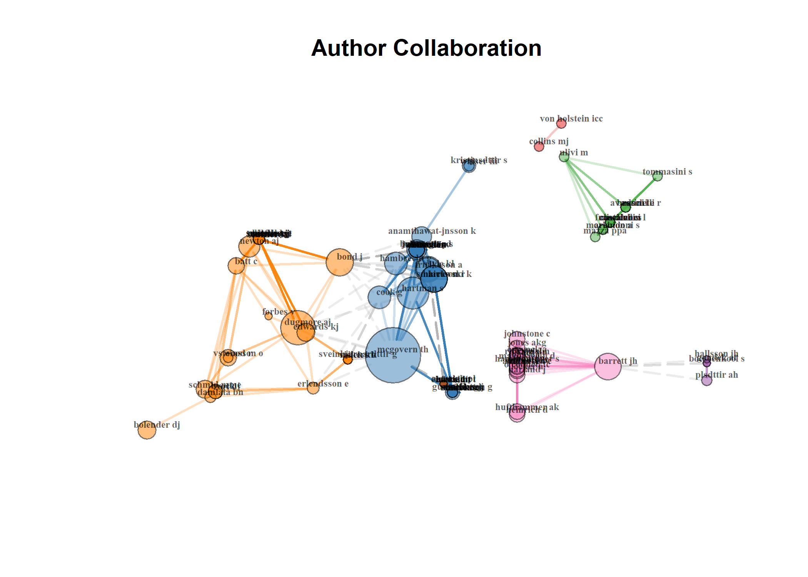
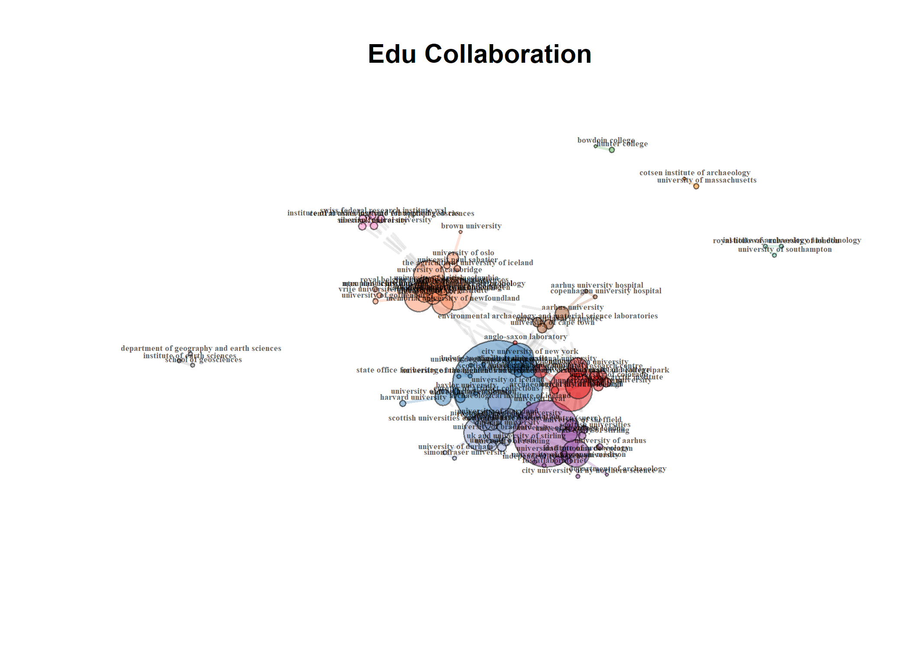

Iceland Archaeology: Bibliometrics
================
Robert Z. Selden, Jr.
10 May, 2021

## Bibliometrics

The dataset used in this analysis was harvested from
[Scopus](https://www.elsevier.com/solutions/scopus), includes all
articles published containing *iceland* AND *archaeology* in the title,
abtract, or keywords, and was analysed using the `bibliometrix` package
(Aria and Cuccurullo 2017).

``` r
# install bibliometrix and load data
# devtools::install_github("massimoaria/bibliometrix")

library(here)
```

    ## here() starts at D:/github/iceland

``` r
library(bibliometrix)
```

    ## To cite bibliometrix in publications, please use:
    ## 
    ## Aria, M. & Cuccurullo, C. (2017) bibliometrix: An R-tool for comprehensive science mapping analysis, 
    ##                                  Journal of Informetrics, 11(4), pp 959-975, Elsevier.
    ##                         
    ## 
    ## https://www.bibliometrix.org
    ## 
    ##                         
    ## For information and bug reports:
    ##                         - Send an email to info@bibliometrix.org   
    ##                         - Write a post on https://github.com/massimoaria/bibliometrix/issues
    ##                         
    ## Help us to keep Bibliometrix free to download and use by contributing with a small donation to support our research team (https://bibliometrix.org/donate.html)
    ## 
    ##                         
    ## To start with the shiny web-interface, please digit:
    ## biblioshiny()

``` r
library(reshape2)
library(ggplot2)
df <- convert2df(file = "arch.bib", 
                 dbsource = "scopus", 
                 format = "bibtex")
```

    ## 
    ## Converting your scopus collection into a bibliographic dataframe
    ## 
    ## Done!
    ## 
    ## 
    ## Generating affiliation field tag AU_UN from C1:  Done!

## Descriptive analysis

``` r
results <- biblioAnalysis(df, 
                          sep = ";")
options(width = 100)
s <- summary(object = results, 
             k = 20, 
             pause = FALSE)
```

    ## 
    ## 
    ## MAIN INFORMATION ABOUT DATA
    ## 
    ##  Timespan                              1987 : 2021 
    ##  Sources (Journals, Books, etc)        62 
    ##  Documents                             95 
    ##  Average years from publication        8.74 
    ##  Average citations per documents       12.38 
    ##  Average citations per year per doc    1.263 
    ##  References                            10207 
    ##  
    ## DOCUMENT TYPES                     
    ##  article               70 
    ##  book                  3 
    ##  book chapter          9 
    ##  conference paper      3 
    ##  erratum               1 
    ##  note                  1 
    ##  review                6 
    ##  short survey          2 
    ##  
    ## DOCUMENT CONTENTS
    ##  Keywords Plus (ID)                    546 
    ##  Author's Keywords (DE)                296 
    ##  
    ## AUTHORS
    ##  Authors                               245 
    ##  Author Appearances                    325 
    ##  Authors of single-authored documents  31 
    ##  Authors of multi-authored documents   214 
    ##  
    ## AUTHORS COLLABORATION
    ##  Single-authored documents             33 
    ##  Documents per Author                  0.388 
    ##  Authors per Document                  2.58 
    ##  Co-Authors per Documents              3.42 
    ##  Collaboration Index                   3.45 
    ##  
    ## 
    ## Annual Scientific Production
    ## 
    ##  Year    Articles
    ##     1987        1
    ##     1988        1
    ##     1990        1
    ##     1997        1
    ##     2001        1
    ##     2003        1
    ##     2004        3
    ##     2005        3
    ##     2006        3
    ##     2007        5
    ##     2008        5
    ##     2009        1
    ##     2010        4
    ##     2011        2
    ##     2012       10
    ##     2013        8
    ##     2014        2
    ##     2015        6
    ##     2016        8
    ##     2017        6
    ##     2018        9
    ##     2019        9
    ##     2020        2
    ##     2021        3
    ## 
    ## Annual Percentage Growth Rate 3.283983 
    ## 
    ## 
    ## Most Productive Authors
    ## 
    ##         Authors        Articles       Authors        Articles Fractionalized
    ## 1  MCGOVERN TH                8 BOLENDER DJ                             3.42
    ## 2  BOLENDER DJ                7 ALDRED O                                2.50
    ## 3  DUGMORE AJ                 7 VSTEINSSON O                            2.20
    ## 4  VSTEINSSON O               5 MCGOVERN TH                             2.03
    ## 5  SCHMID MME                 4 LUCAS G                                 2.00
    ## 6  ALDRED O                   3 PLSSON G                                2.00
    ## 7  BARRETT JH                 3 DUGMORE AJ                              1.94
    ## 8  BYOCK J                    3 MILEK K                                 1.70
    ## 9  DAMIATA BN                 3 FORBES V                                1.67
    ## 10 FORBES V                   3 BOLENDER D                              1.50
    ## 11 HAMBRECHT G                3 SVEINBJARNARDOTTIR G                    1.33
    ## 12 HARTMAN S                  3 GESTSDTTIR H                            1.25
    ## 13 KRISTJNSDTTIR S            3 PRICE TD                                1.25
    ## 14 LUCAS G                    3 HAMBRECHT G                             1.22
    ## 15 MILEK K                    3 BALTER M                                1.00
    ## 16 NEWTON AJ                  3 CATLIN KA                               1.00
    ## 17 SAYLE KL                   3 CHICONE SJ                              1.00
    ## 18 ZORI D                     3 COSTELLO E                              1.00
    ## 19 ANAMTHAWAT-JNSSON K        2 ELIAS SA                                1.00
    ## 20 BATT C                     2 GARCA LPEZ I                            1.00
    ## 
    ## 
    ## Top manuscripts per citations
    ## 
    ##                                                                                           Paper         
    ## 1  BARRETT JH, 2004, PROC R SOC B BIOL SCI                                                              
    ## 2  BECK JR. RA, 2007, CURR ANTHROPOL                                                                    
    ## 3  BARRETT JH, 2011, J ARCHAEOL SCI                                                                     
    ## 4  MCGOVERN TH, 1988, HUM ECOL                                                                          
    ## 5  STODDER ALW, 2012, THE BIOARCHAEOLOGY OF INDIVID                                                     
    ## 6  MILEK KB, 2013, J ARCHAEOL SCI                                                                       
    ## 7  JORGENSEN TH, 2004, HUM GENET                                                                        
    ## 8  FREI KM, 2015, WORLD ARCHAEOL                                                                        
    ## 9  KOLZENBURG S, 2017, BULL VOLCANOL                                                                    
    ## 10 MCGOVERN TH, 2006, ENVIRON ARCHEOL                                                                   
    ## 11 SAYLE KL, 2013, GEOCHIM COSMOCHIM ACTA                                                               
    ## 12 SVEINBJRNSDTTIR AE, 2004, RADIOCARBON                                                                
    ## 13 BOLENDER DJ, 2010, EVENTFUL ARCHAEOLOGIES: NEW APPROACHES TO SOC TRANSFORMATION IN THE ARCHAEO RECORD
    ## 14 SVEINBJARNARDTTIR G, 2007, ENVIRON ARCHEOL                                                           
    ## 15 STREETER R, 2013, PROC NATL ACAD SCI U S A                                                           
    ## 16 BYOCK J, 2005, MEDIEV ARCHAEOL                                                                       
    ## 17 BATHURST RR, 2010, J ARCHAEOL SCI                                                                    
    ## 18 PTURSDTTIR P, 2017, ARCHAEOL DIALOGUES                                                               
    ## 19 SWINDLES GT, 2013, HOLOCENE                                                                          
    ## 20 HARTMAN S, 2017, GLOBAL PLANET CHANGE                                                                
    ##                                DOI  TC TCperYear   NTC
    ## 1  10.1098/rspb.2004.2885          114      6.33 1.988
    ## 2  10.1086/520974                  106      7.07 3.464
    ## 3  10.1016/j.jas.2011.02.017        99      9.00 1.980
    ## 4  10.1007/BF00888447               69      2.03 1.000
    ## 5  NA                               64      6.40 5.079
    ## 6  10.1016/j.jas.2012.10.031        45      5.00 2.571
    ## 7  10.1007/s00439-004-1117-7        35      1.94 0.610
    ## 8  10.1080/00438243.2015.1025912    34      4.86 2.582
    ## 9  10.1007/s00445-017-1128-6        31      6.20 2.385
    ## 10 10.1179/174963106x123205         29      1.81 2.071
    ## 11 10.1016/j.gca.2013.07.008        24      2.67 1.371
    ## 12 10.1017/S0033822200039692        23      1.28 0.401
    ## 13 NA                               22      1.83 1.833
    ## 14 10.1179/174963107x226453         22      1.47 0.719
    ## 15 10.1073/pnas.1220161110          21      2.33 1.200
    ## 16 10.1179/007660905x54080          21      1.24 2.864
    ## 17 10.1016/j.jas.2010.07.002        20      1.67 1.667
    ## 18 10.1017/S1380203817000216        19      3.80 1.462
    ## 19 10.1177/0959683613489586         19      2.11 1.086
    ## 20 10.1016/j.gloplacha.2017.04.007  17      3.40 1.308
    ## 
    ## 
    ## Corresponding Author's Countries
    ## 
    ##           Country Articles   Freq SCP MCP MCP_Ratio
    ## 1  UNITED KINGDOM       24 0.3429   8  16     0.667
    ## 2  USA                  15 0.2143  11   4     0.267
    ## 3  ICELAND              13 0.1857   7   6     0.462
    ## 4  DENMARK               4 0.0571   3   1     0.250
    ## 5  NORWAY                4 0.0571   3   1     0.250
    ## 6  CANADA                3 0.0429   1   2     0.667
    ## 7  ITALY                 2 0.0286   1   1     0.500
    ## 8  SWEDEN                2 0.0286   1   1     0.500
    ## 9  GERMANY               1 0.0143   0   1     1.000
    ## 10 IRELAND               1 0.0143   1   0     0.000
    ## 11 SPAIN                 1 0.0143   1   0     0.000
    ## 
    ## 
    ## SCP: Single Country Publications
    ## 
    ## MCP: Multiple Country Publications
    ## 
    ## 
    ## Total Citations per Country
    ## 
    ##      Country      Total Citations Average Article Citations
    ## 1  UNITED KINGDOM             453                     18.88
    ## 2  USA                        230                     15.33
    ## 3  DENMARK                     75                     18.75
    ## 4  ICELAND                     66                      5.08
    ## 5  CANADA                      42                     14.00
    ## 6  ITALY                       34                     17.00
    ## 7  NORWAY                      31                      7.75
    ## 8  SWEDEN                      18                      9.00
    ## 9  GERMANY                     11                     11.00
    ## 10 SPAIN                        6                      6.00
    ## 11 IRELAND                      3                      3.00
    ## 
    ## 
    ## Most Relevant Sources
    ## 
    ##                                                               Sources        Articles
    ## 1  JOURNAL OF ARCHAEOLOGICAL SCIENCE                                               10
    ## 2  INTERNATIONAL JOURNAL OF HISTORICAL ARCHAEOLOGY                                  6
    ## 3  ENVIRONMENTAL ARCHAEOLOGY                                                        4
    ## 4  HOLOCENE                                                                         3
    ## 5  JOURNAL OF ARCHAEOLOGICAL SCIENCE: REPORTS                                       3
    ## 6  MEDIEVAL ARCHAEOLOGY                                                             3
    ## 7  HISTORICAL ARCHAEOLOGY                                                           2
    ## 8  HUMAN ECOLOGY                                                                    2
    ## 9  NEUROSURGERY                                                                     2
    ## 10 NORWEGIAN ARCHAEOLOGICAL REVIEW                                                  2
    ## 11 PLOS ONE                                                                         2
    ## 12 QUATERNARY GEOCHRONOLOGY                                                         2
    ## 13 RADIOCARBON                                                                      2
    ## 14 SCIENCE                                                                          2
    ## 15 WORLD ARCHAEOLOGY                                                                2
    ## 16 A COMPANION TO OLD NORSE-ICELANDIC LITERATURE AND CULTURE: SECOND EDITION        1
    ## 17 ACTA ARCHAEOLOGICA                                                               1
    ## 18 AMBIO                                                                            1
    ## 19 AMERICAN JOURNAL OF PHYSICAL ANTHROPOLOGY                                        1
    ## 20 ANTHROPOCENE                                                                     1
    ## 
    ## 
    ## Most Relevant Keywords
    ## 
    ##    Author Keywords (DE)      Articles  Keywords-Plus (ID)     Articles
    ## 1    ICELAND                       25 ICELAND                       58
    ## 2    ARCHAEOLOGY                    8 ARCHAEOLOGY                   38
    ## 3    TEPHROCHRONOLOGY               6 HISTORY                       20
    ## 4    VIKING AGE                     6 ARCHEOLOGY                    13
    ## 5    NORTH ATLANTIC                 5 GREENLAND                     13
    ## 6    NORSE                          4 ARCHAEOLOGICAL EVIDENCE       11
    ## 7    ZOOARCHAEOLOGY                 4 ARTICLE                       11
    ## 8    ARCHAEOENTOMOLOGY              3 HUMAN                         10
    ## 9    BAYESIAN OUTLIER MODELS        3 HUMAN SETTLEMENT              10
    ## 10   COD                            3 MEDIEVAL                      10
    ## 11   HISTORICAL ARCHAEOLOGY         3 ARCTIC                         9
    ## 12   MEDIEVAL                       3 CLIMATE CHANGE                 8
    ## 13   TEPHRA                         3 MALE                           8
    ## 14   ACTIVITY ZONE                  2 TEPHROCHRONOLOGY               8
    ## 15   ANTHROPOCENE                   2 MIDDLE AGES                    7
    ## 16   BAYESIAN STATISTICS            2 NORWAY                         7
    ## 17   BEETLES                        2 PRIORITY JOURNAL               7
    ## 18   BIOARCHAEOLOGY                 2 RADIOCARBON DATING             7
    ## 19   CLIMATE CHANGE                 2 FEMALE                         6
    ## 20   COASTAL ARCHAEOLOGY            2 HUMAN ACTIVITY                 6

``` r
# plot attributes
plot(x = results, 
     k = 20, 
     pause = FALSE)
```


### Attributes of the local network

``` r
# calculate citations in local network
CR <- localCitations(df, sep = ";")

# top 20 cited authors in local network
CR$Authors[1:20,]
```

    ##                  Author LocalCitations
    ## 86         GARCA LPEZ I              6
    ## 152            MARTIN K              6
    ## 156          MCCARTHY J              6
    ## 14             BALTER M              5
    ## 44           COLLINS MJ              5
    ## 59           DUGMORE AJ              5
    ## 77             FORBES V              5
    ## 234    VON HOLSTEIN ICC              5
    ## 6   ANAMTHAWAT-JNSSON K              4
    ## 135     KRISTJNSDTTIR S              4
    ## 163            MILEK KB              4
    ## 193       RHALLSDTTIR R              4
    ## 197          ROBERTS HM              4
    ## 237          WALSER III              4
    ## 53            DAVIES GR              3
    ## 76               FONT L              3
    ## 137           LAFSSON E              3
    ## 183          PEACOCK EE              3
    ## 202          SCHMID MME              3
    ## 9            ARNEBORG J              2

``` r
# top 20 cited papers in local network
CR$Papers[1:20,]
```

    ##                                                             Paper                            DOI Year LCS GCS
    ## 81                             MCGOVERN TH, 2006, ENVIRON ARCHEOL       10.1179/174963106x123205 2006   6  29
    ## 89                          SVEINBJRNSDTTIR AE, 2004, RADIOCARBON      10.1017/S0033822200039692 2004   6  23
    ## 35                            STEINBERG JM, 2016, J FIELD ARCHEOL  10.1080/00934690.2016.1203210 2016   5  10
    ## 38                                  BATT CM, 2015, J ARCHAEOL SCI      10.1016/j.jas.2015.07.002 2015   4  12
    ## 84                                 BYOCK J, 2005, MEDIEV ARCHAEOL        10.1179/007660905x54080 2005   4  21
    ## 46                         SAYLE KL, 2013, GEOCHIM COSMOCHIM ACTA      10.1016/j.gca.2013.07.008 2013   3  24
    ## 55 BOLENDER D, 2012, THE ANTHROPOLOGICAL STUD OF CL AND CONSCIOUS                                2012   3   4
    ## 41                                  FREI KM, 2015, WORLD ARCHAEOL  10.1080/00438243.2015.1025912 2015   2  34
    ## 48                           FORBES V, 2013, INT J PALEOPATHOLOGY     10.1016/j.ijpp.2013.07.004 2013   2  10
    ## 53                                 MILEK KB, 2013, J ARCHAEOL SCI      10.1016/j.jas.2012.10.031 2013   2  45
    ## 54                                 MILEK K, 2012, MEDIEV ARCHAEOL 10.1179/0076609712Z.0000000004 2012   2  15
    ## 58                             LUCAS G, 2012, INT J HIST ARCHAEOL      10.1007/s10761-012-0185-y 2012   2   8
    ## 62                            ALDRED O, 2012, INT J HIST ARCHAEOL      10.1007/s10761-012-0187-9 2012   2   8
    ## 65                               BARRETT JH, 2011, J ARCHAEOL SCI      10.1016/j.jas.2011.02.017 2011   2  99
    ## 94                                    MCGOVERN TH, 1988, HUM ECOL             10.1007/BF00888447 1988   2  69
    ## 7                                        PLSSON G, 2019, HUM ECOL     10.1007/s10745-019-00092-w 2019   1   1
    ## 16                              SCHMID MME, 2018, QUAT GEOCHRONOL   10.1016/j.quageo.2018.07.015 2018   1   7
    ## 20                                     SCHMID MME, 2018, HOLOCENE       10.1177/0959683617714597 2018   1   7
    ## 39                                 FORBES V, 2015, J ARCHAEOL SCI      10.1016/j.jas.2015.05.008 2015   1   5
    ## 42                                   BREWINGTON S, 2015, HOLOCENE       10.1177/0959683615591714 2015   1  14

## Most cited

### Most cited articles

``` r
# most cited references in global network
mcr <- citations(df, 
                 field = "article", 
                 sep = ";")
cbind(mcr$Cited[1:20])
```

    ##                                                                                                                                                                                                                                                           [,1]
    ## MARKUS, R.A., (1990) THE END OF ANCIENT CHRISTIANITY, , CAMBRIDGE: CAMBRIDGE UNIVERSITY PRESS                                                                                                                                                                7
    ## REPRINT, GRAZ: AKADEMISCHE DRUCK- UND VERLAGSANSTALT                                                                                                                                                                                                         6
    ## BRONK RAMSEY, C., BAYESIAN ANALYSIS OF RADIOCARBON DATES (2009) RADIOCARBON, 51 (1), PP. 337-360                                                                                                                                                             4
    ## CHARLES-EDWARDS, T.M., (2000) EARLY CHRISTIAN IRELAND, , CAMBRIDGE: CAMBRIDGE UNIVERSITY PRESS                                                                                                                                                               4
    ## CLAUSSEN, M.A., (2004) THE REFORM OF THE FRANKISH CHURCH: CHRODEGANG OF METZ AND THE REGULA CANONICORUM IN THE EIGHTH CENTURY, , CAMBRIDGE: CAMBRIDGE UNIVERSITY PRESS                                                                                       4
    ## CUBITT, C., (1995) ANGLO-SAXON CHURCH COUNCILS, C. 650-C. 850, , LONDON: LEICESTER UNIVERSITY PRESS                                                                                                                                                          4
    ## DUGMORE, A.J., CHURCH, M.J., BUCKLAND, P.C., EDWARDS, K.J., LAWSON, I., MCGOVERN, T.H., PANAGIOTAKOPULU, E., SVEINBJARNARDTTIR, G., THE NORSE LANDNM ON THE NORTH ATLANTIC ISLANDS: AN ENVIRONMENTAL IMPACT ASSESSMENT (2005) POLAR RECORD, 41, PP. 21-37    4
    ## FLINT, V., (1991) THE RISE OF MAGIC IN EARLY MEDIEVAL EUROPE, , OXFORD: CLARENDON PRESS                                                                                                                                                                      4
    ## HUGHES, K., (1966) THE CHURCH IN EARLY IRISH SOCIETY, , LONDON: METHUEN                                                                                                                                                                                      4
    ## MARKUS, R.A., (1997) GREGORY THE GREAT AND HIS WORLD, , CAMBRIDGE: CAMBRIDGE UNIVERSITY PRESS                                                                                                                                                                4
    ## MORRIS, R., (1995) MONKS AND LAYMEN IN BYZANTIUM, 843-1118, , CAMBRIDGE: CAMBRIDGE UNIVERSITY PRESS                                                                                                                                                          4
    ## NOBLE, T., (1984) THE REPUBLIC OF ST. PETER: THE BIRTH OF THE PAPAL STATE, 680-825, , PHILADELPHIA, PA: UNIVERSITY OF PENNSYLVANIA PRESS                                                                                                                     4
    ## ROSENWEIN, B.H., (1999) NEGOTIATING SPACE: POWER, RESTRAINT, AND PRIVILEGES OF IMMUNITY IN EARLY MEDIEVAL EUROPE, , ITHACA, NY: CORNELL UNIVERSITY PRESS                                                                                                     4
    ## VAN DAM, R., (1993) SAINTS AND THEIR MIRACLES IN LATE ANTIQUE GAUL, , PRINCETON, NJ: PRINCETON UNIVERSITY PRESS                                                                                                                                              4
    ## WEMPLE, S.F., (1981) WOMEN IN FRANKISH SOCIETY: MARRIAGE AND THE CLOISTER, , PHILADELPHIA, PA: UNIVERSITY OF PENNSYLVANIA PRESS                                                                                                                              4
    ## , CAMBRIDGE: QUATERNARY RESEARCH ASSOCIATION                                                                                                                                                                                                                 3
    ## ARNALDS, O., HALLMARK, C.T., WILDING, L.P., ANDISOLS FROM FOUR DIFFERENT REGIONS OF ICELAND (1995) SOIL SCI. SOC. AM. J., 59, PP. 161-169                                                                                                                    3
    ## BECK, H.-G., (1959) KIRCHE UND THEOLOGISCHE LITERATUR IM BYZANTINISCHEN REICH, , MUNICH: C. H. BECK                                                                                                                                                          3
    ## BERSON, B., A CONTRIBUTION TO THE STUDY OF THE MEDIEVAL ICELANDIC FARM: THE BYRES (2002) ARCHAEOLOGICAL ISLANDICA, 2, PP. 34-60                                                                                                                              3
    ## BLAIR, J., (2005) THE CHURCH IN ANGLO-SAXON SOCIETY, , OXFORD: OXFORD UNIVERSITY PRESS                                                                                                                                                                       3

### Most cited authors

``` r
# most cited authors in global network
mcr <- citations(df, 
                 field = "author", 
                 sep = ";")
cbind(mcr$Cited[1:20])
```

    ##                     [,1]
    ## MCGOVERN T H         210
    ## VSTEINSSON O         164
    ## DUGMORE A J          143
    ## BUCKLAND P C          83
    ## CHURCH M J            70
    ## SVEINBJARNARDTTIR G   70
    ## EDWARDS K J           62
    ## BROWN P               61
    ## LUCAS G               59
    ## SIMPSON I A           59
    ## COOK G T              52
    ## LARSEN G              52
    ## EINARSSON             50
    ## GESTSDTTIR H          46
    ## BRONK RAMSEY C        44
    ## PERDIKARIS S          43
    ## ASCOUGH P L           40
    ## NELSON J L            39
    ## AMOROSI T             38
    ## NEWTON A J            37

### Author dominance ranking

``` r
dom <- biblioAnalysis(df)
dom.r <- dominance(dom)
dom.r
```

    ##         Author Dominance Factor Tot Articles Single-Authored Multi-Authored First-Authored Rank by Articles Rank by DF
    ## 1     FORBES V        1.0000000            3               1              2              2                4          1
    ## 2   SCHMID MME        0.7500000            4               0              4              3                3          2
    ## 3   BARRETT JH        0.6666667            3               0              3              2                4          3
    ## 4      LUCAS G        0.5000000            3               1              2              1                4          4
    ## 5      FREI KM        0.5000000            2               0              2              1               10          4
    ## 6  BOLENDER DJ        0.3333333            7               1              6              2                2          6
    ## 7      BYOCK J        0.3333333            3               0              3              1                4          6
    ## 8    HARTMAN S        0.3333333            3               0              3              1                4          6
    ## 9     SAYLE KL        0.3333333            3               0              3              1                4          6
    ## 10 MCGOVERN TH        0.2857143            8               1              7              2                1         10

## Intellectual structure

### Author co-citation

Co-citation analysis is the most commonly used bibliometric analysis
method (Ding, Chowdhury, and Foo 2001), and is defined as two
publications that are cited together in one article (Small 1973).

``` r
# extract author names from reference items
df <- metaTagExtraction(df,
                        Field = "CR_AU")

# author co-citation network
auth.co.mat <- biblioNetwork(df, 
                             analysis = "co-citation", 
                             network = "authors", 
                             sep = ";")

# network plot
auth.co.net = networkPlot(auth.co.mat, 
                          n = 50, 
                          Title = "Author Co-Citation Network", 
                          type = "auto", 
                          size = 10, 
                          size.cex = T, 
                          remove.multiple = FALSE, 
                          labelsize = 0.5, 
                          edgesize = 8, 
                          edges.min = 3, 
                          remove.isolates = TRUE)
```



``` r
# descriptive analysis of author co-citation network
auth.co.netstat <- networkStat(auth.co.mat)
summary(auth.co.netstat, k = 15)
```

    ## 
    ## 
    ## Main statistics about the network
    ## 
    ##  Size                                  4471 
    ##  Density                               0.248 
    ##  Transitivity                          0.986 
    ##  Diameter                              3 
    ##  Degree Centralization                 0.441 
    ##  Average path length                   1.81 
    ## 

### Author coupling

Coupling is a similarity measure that uses citation analysis to
illustrate a similarity relationship between documents. Author coupling
occurs when two authors reference a common third author in their
bibliographies.

``` r
# author coupling network
auth.coup.mat <- biblioNetwork(df, 
                             analysis = "coupling", 
                             network = "authors", 
                             sep = ";")

# network plot
auth.coup.net = networkPlot(auth.coup.mat, 
                          n = 50, 
                          Title = "Author Coupling Network", 
                          type = "mds", 
                          size = 25, 
                          size.cex = T,
                          remove.multiple = FALSE, 
                          labelsize = 0.5, 
                          edgesize = 10, 
                          edges.min = 8, 
                          remove.isolates = TRUE)
```



``` r
# descriptive analysis of author coupling network
auth.coup.netstat <- networkStat(auth.coup.mat)
summary(auth.coup.netstat, k = 15)
```

    ## 
    ## 
    ## Main statistics about the network
    ## 
    ##  Size                                  245 
    ##  Density                               0.2 
    ##  Transitivity                          0.575 
    ##  Diameter                              4 
    ##  Degree Centralization                 0.542 
    ##  Average path length                   1.874 
    ## 

## Historiograph direct citation linkages

The historiographic map is a chronological network map of the most
relevant direct citations resulting from this bibliographic collection.

``` r
# historical citation network
options(width = 100)
histResults <- histNetwork(df, 
                           min.citations = 20, 
                           sep = ";")
```

    ## 
    ## SCOPUS DB: Searching local citations (LCS) by document titles (TI) and DOIs...
    ## 
    ## Found 13 documents with no empty Local Citations (LCS)

``` r
# plot historical co-citation network
hnet <- histPlot(histResults, 
                 n = 100, 
                 size = 6, 
                 labelsize = 2)
```



    ## 
    ##  Legend
    ## 
    ##                                                             Label                             DOI
    ## 1                                   FREI KM, 2015, WORLD ARCHAEOL   10.1080/00438243.2015.1025912
    ## 2                          SAYLE KL, 2013, GEOCHIM COSMOCHIM ACTA       10.1016/j.gca.2013.07.008
    ## 3                      STREETER R, 2013, PROC NATL ACAD SCI U S A         10.1073/pnas.1220161110
    ## 4                                  MILEK KB, 2013, J ARCHAEOL SCI       10.1016/j.jas.2012.10.031
    ## 5                                BARRETT JH, 2011, J ARCHAEOL SCI       10.1016/j.jas.2011.02.017
    ## 6                      SVEINBJARNARDTTIR G, 2007, ENVIRON ARCHEOL        10.1179/174963107x226453
    ## 7                               BECK JR. RA, 2007, CURR ANTHROPOL                  10.1086/520974
    ## 8                              MCGOVERN TH, 2006, ENVIRON ARCHEOL        10.1179/174963106x123205
    ## 9                                  BYOCK J, 2005, MEDIEV ARCHAEOL         10.1179/007660905x54080
    ## 10                        BARRETT JH, 2004, PROC R SOC B BIOL SCI          10.1098/rspb.2004.2885
    ## 11                                  JORGENSEN TH, 2004, HUM GENET       10.1007/s00439-004-1117-7
    ## 12                          SVEINBJRNSDTTIR AE, 2004, RADIOCARBON       10.1017/S0033822200039692
    ## 13                                    MCGOVERN TH, 1988, HUM ECOL              10.1007/BF00888447
    ## 14                                 SMITH KP, 2021, J ARCHAEOL SCI       10.1016/j.jas.2020.105316
    ## 15                          HARTMAN S, 2017, GLOBAL PLANET CHANGE 10.1016/j.gloplacha.2017.04.007
    ## 16                        HAMILTON WD, 2019, J ISL COAST ARCHAEOL   10.1080/15564894.2017.1363097
    ## 17                                  BATT CM, 2015, J ARCHAEOL SCI       10.1016/j.jas.2015.07.002
    ## 18                                   BREWINGTON S, 2015, HOLOCENE        10.1177/0959683615591714
    ## 19                                  CATLIN KA, 2016, ANTHROPOCENE    10.1016/j.ancene.2015.12.005
    ## 20                           MIKOAJCZYK, 2016, J ARCHAEOL SCI REP    10.1016/j.jasrep.2016.08.036
    ## 21                            STEINBERG JM, 2016, J FIELD ARCHEOL   10.1080/00934690.2016.1203210
    ## 22                                    LAFSDTTIR G, 2017, PLOS ONE    10.1371/journal.pone.0187134
    ## 23                               VICKERS K, 2013, ENVIRON ARCHEOL 10.1179/1461410313Z.00000000029
    ## 24                                   ZOGA G, 2017, J SOC ARCHAEOL        10.1177/1469605316673927
    ## 25                          WALSER III, 2020, AM J PHYS ANTHROPOL              10.1002/ajpa.23973
    ## 26 BOLENDER D, 2012, THE ANTHROPOLOGICAL STUD OF CL AND CONSCIOUS                                
    ## 27                                     SCHMID MME, 2018, HOLOCENE        10.1177/0959683617714597
    ## 28                                    PRICE TD, 2018, J NORTH ATL          10.3721/037.002.0sp711
    ## 29                              BATHURST RR, 2010, J ARCHAEOL SCI       10.1016/j.jas.2010.07.002
    ## 30                                  SCHMID MME, 2019, RADIOCARBON            10.1017/RDC.2018.129
    ## 31                                      GARCA LPEZ I, 2019, SVMMA          10.1344/Svmma2019.13.4
    ##    Year LCS GCS
    ## 1  2015   2  34
    ## 2  2013   3  24
    ## 3  2013   1  21
    ## 4  2013   2  45
    ## 5  2011   2  99
    ## 6  2007   1  22
    ## 7  2007   1 106
    ## 8  2006   6  29
    ## 9  2005   4  21
    ## 10 2004   1 114
    ## 11 2004   1  35
    ## 12 2004   6  23
    ## 13 1988   2  69
    ## 14 2021   0   0
    ## 15 2017   0  17
    ## 16 2019   0   3
    ## 17 2015   0  12
    ## 18 2015   0  14
    ## 19 2016   0   8
    ## 20 2016   0   3
    ## 21 2016   0  10
    ## 22 2017   0   4
    ## 23 2013   0   4
    ## 24 2017   0   1
    ## 25 2020   0   2
    ## 26 2012   0   4
    ## 27 2018   0   7
    ## 28 2018   0   0
    ## 29 2010   0  20
    ## 30 2019   0   2
    ## 31 2019   0   0

### ID and DE keyword associations

``` r
list <- keywordAssoc(df, 
                     sep = ";", 
                     n = 10)

list[[1]][1:10]
```

    ##                 ICELAND             ARCHAEOLOGY        TEPHROCHRONOLOGY              VIKING AGE 
    ##                      13                       5                       5                       3 
    ##          ZOOARCHAEOLOGY BAYESIAN OUTLIER MODELS                  TEPHRA                   NORSE 
    ##                       3                       3                       3                       2 
    ##       ARCHAEOENTOMOLOGY                     COD 
    ##                       2                       2

### Yearly occurrences of top keywords/terms

#### Authors’ keywords

``` r
topKW = KeywordGrowth(df, 
                      Tag = "DE", 
                      sep = ";", 
                      top = 10, 
                      cdf = TRUE)

topKW
```

    ##    Year ICELAND ARCHAEOLOGY TEPHROCHRONOLOGY VIKING AGE NORTH ATLANTIC NORSE ZOOARCHAEOLOGY
    ## 1  1988       0           0                0          0              1     1              0
    ## 2  1989       0           0                0          0              1     1              0
    ## 3  1990       0           0                0          0              1     1              0
    ## 4  1991       0           0                0          0              1     1              0
    ## 5  1992       0           0                0          0              1     1              0
    ## 6  1993       0           0                0          0              1     1              0
    ## 7  1994       0           0                0          0              1     1              0
    ## 8  1995       0           0                0          0              1     1              0
    ## 9  1996       0           0                0          0              1     1              0
    ## 10 1997       0           0                0          0              1     1              0
    ## 11 1998       0           0                0          0              1     1              0
    ## 12 1999       0           0                0          0              1     1              0
    ## 13 2000       0           0                0          0              1     1              0
    ## 14 2001       0           0                0          0              1     1              0
    ## 15 2002       0           0                0          0              1     1              0
    ## 16 2003       0           0                0          0              1     1              0
    ## 17 2004       0           1                0          0              1     1              0
    ## 18 2005       0           1                0          0              1     1              0
    ## 19 2006       0           1                0          0              1     1              1
    ## 20 2007       2           1                0          1              1     1              1
    ## 21 2008       3           2                0          1              1     1              1
    ## 22 2009       3           2                0          1              1     1              1
    ## 23 2010       3           3                0          1              1     1              1
    ## 24 2011       3           3                0          1              1     1              1
    ## 25 2012       5           4                0          1              2     1              2
    ## 26 2013       7           5                1          1              2     1              2
    ## 27 2014       7           5                1          1              2     1              2
    ## 28 2015      10           5                2          2              3     3              3
    ## 29 2016      13           6                2          3              3     4              3
    ## 30 2017      15           7                2          3              3     4              4
    ## 31 2018      17           7                5          4              4     4              4
    ## 32 2019      22           8                5          5              5     4              4
    ## 33 2020      23           8                6          5              5     4              4
    ## 34 2021      25           8                6          6              5     4              4
    ##    ARCHAEOENTOMOLOGY BAYESIAN OUTLIER MODELS COD
    ## 1                  0                       0   0
    ## 2                  0                       0   0
    ## 3                  0                       0   0
    ## 4                  0                       0   0
    ## 5                  0                       0   0
    ## 6                  0                       0   0
    ## 7                  0                       0   0
    ## 8                  0                       0   0
    ## 9                  0                       0   0
    ## 10                 0                       0   0
    ## 11                 0                       0   0
    ## 12                 0                       0   0
    ## 13                 0                       0   0
    ## 14                 0                       0   0
    ## 15                 0                       0   0
    ## 16                 0                       0   0
    ## 17                 0                       0   1
    ## 18                 0                       0   1
    ## 19                 0                       0   2
    ## 20                 0                       0   2
    ## 21                 0                       0   2
    ## 22                 0                       0   2
    ## 23                 0                       0   2
    ## 24                 0                       0   3
    ## 25                 0                       0   3
    ## 26                 1                       0   3
    ## 27                 1                       0   3
    ## 28                 2                       0   3
    ## 29                 3                       0   3
    ## 30                 3                       0   3
    ## 31                 3                       2   3
    ## 32                 3                       3   3
    ## 33                 3                       3   3
    ## 34                 3                       3   3

``` r
# plot results
key.plot = melt(topKW, 
                id ='Year')

ggplot(key.plot, aes(Year, 
                     value, 
                     group = variable, 
                     color = variable)) + 
  geom_line()
```


#### Publisher’s keywords

``` r
topKW = KeywordGrowth(df, 
                      Tag = "ID", 
                      sep = ";", 
                      top = 10, 
                      cdf = TRUE)

topKW
```

    ##    Year ICELAND ARCHAEOLOGY HISTORY ARCHEOLOGY GREENLAND ARCHAEOLOGICAL EVIDENCE ARTICLE HUMAN
    ## 1  1987       1           1       0          0         0                       0       0     0
    ## 2  1988       2           2       0          0         1                       0       0     0
    ## 3  1989       2           2       0          0         1                       0       0     0
    ## 4  1990       2           2       0          0         1                       0       0     0
    ## 5  1991       2           2       0          0         1                       0       0     0
    ## 6  1992       2           2       0          0         1                       0       0     0
    ## 7  1993       2           2       0          0         1                       0       0     0
    ## 8  1994       2           2       0          0         1                       0       0     0
    ## 9  1995       2           2       0          0         1                       0       0     0
    ## 10 1996       2           2       0          0         1                       0       0     0
    ## 11 1997       2           2       0          0         1                       0       0     0
    ## 12 1998       2           2       0          0         1                       0       0     0
    ## 13 1999       2           2       0          0         1                       0       0     0
    ## 14 2000       2           2       0          0         1                       0       0     0
    ## 15 2001       2           2       0          0         1                       0       0     0
    ## 16 2002       2           2       0          0         1                       0       0     0
    ## 17 2003       2           2       0          0         1                       0       0     0
    ## 18 2004       7           4       3          3         1                       1       2     3
    ## 19 2005       9           4       5          5         3                       1       2     3
    ## 20 2006      10           4       5          6         3                       1       3     4
    ## 21 2007      14           6      11          7         6                       2       4     4
    ## 22 2008      16           6      13          7         9                       2       6     6
    ## 23 2009      16           6      13          7         9                       2       6     6
    ## 24 2010      18           8      13          7         9                       3       6     6
    ## 25 2011      20          11      13          8         9                       3       6     7
    ## 26 2012      25          16      13          8         9                       5       6     7
    ## 27 2013      31          17      15          9         9                       5       8     8
    ## 28 2014      32          18      15          9         9                       5       8     8
    ## 29 2015      37          22      15          9        10                       7       8     8
    ## 30 2016      41          26      17         11        12                       8       9     9
    ## 31 2017      45          31      17         12        13                       9       9     9
    ## 32 2018      49          34      17         12        13                       9      10     9
    ## 33 2019      53          36      18         12        13                      11      10     9
    ## 34 2020      57          37      20         13        13                      11      11    10
    ## 35 2021      58          38      20         13        13                      11      11    10
    ##    HUMAN SETTLEMENT MEDIEVAL
    ## 1                 0        1
    ## 2                 0        1
    ## 3                 0        1
    ## 4                 0        1
    ## 5                 0        1
    ## 6                 0        1
    ## 7                 0        1
    ## 8                 0        1
    ## 9                 0        1
    ## 10                0        1
    ## 11                0        1
    ## 12                0        1
    ## 13                0        1
    ## 14                0        1
    ## 15                0        1
    ## 16                0        1
    ## 17                0        1
    ## 18                1        2
    ## 19                1        2
    ## 20                1        2
    ## 21                2        3
    ## 22                2        3
    ## 23                2        3
    ## 24                3        3
    ## 25                4        4
    ## 26                5        5
    ## 27                5        6
    ## 28                5        6
    ## 29                6        7
    ## 30                6        8
    ## 31                6        9
    ## 32                9        9
    ## 33                9        9
    ## 34                9       10
    ## 35               10       10

``` r
# plot results
key.plot = melt(topKW, 
                id ='Year')

ggplot(key.plot, aes(Year, 
                     value, 
                     group = variable, 
                     color = variable)) + 
  geom_line()
```


## Conceptual structure

### Co-word analysis

The co-word analysis maps the conceptual structure of a research domain
using the co-occurrence of author keywords in the bibliographic
collection.

#### Authors’ keywords

``` r
# using authors keywords
cw <- conceptualStructure(df, 
                          field = "DE", 
                          method = "MDS", 
                          minDegree = 2, 
                          clust = "auto", 
                          stemming = FALSE, 
                          labelsize = 10, 
                          documents = 50)
```



#### Publisher’s keywords

``` r
# using publishers keywords
cw <- conceptualStructure(df, 
                          field = "ID", 
                          method = "MDS", 
                          minDegree = 2, 
                          clust = "auto", 
                          stemming = FALSE, 
                          labelsize = 5, 
                          documents = 50)
```



## Social structure

### Author collaboration

Scientific collaborations are plotted where nodes are authors and links
are co-authorships, illustrating collaborations between authors.

``` r
# author collaboration network
auth.collab <- biblioNetwork(df, 
                             analysis = "collaboration", 
                             network = "authors", 
                             sep = ";")

# network plot
auth.collabnet = networkPlot(auth.collab, 
                             n = 100, 
                             Title = "Author Collaboration", 
                             type = "mds", 
                             size = 20, 
                             size.cex = T,
                             edgesize = 2, 
                             labelsize = 0.5,
                             remove.multiple = TRUE,
                             remove.isolates = TRUE)
```



``` r
# descriptive analysis of author collaboration network
auth.collab.netstat <- networkStat(auth.collab)
summary(auth.collab.netstat, k = 15)
```

    ## 
    ## 
    ## Main statistics about the network
    ## 
    ##  Size                                  245 
    ##  Density                               0.032 
    ##  Transitivity                          0.787 
    ##  Diameter                              8 
    ##  Degree Centralization                 0.16 
    ##  Average path length                   2.849 
    ## 

### Edu collaboration

Scientific collaborations are plotted where nodes are institutions and
links are co-authorships, illustrating collaborations between
institutions.

``` r
# author collaboration network
edu.collab <- biblioNetwork(df, 
                            analysis = "collaboration", 
                            network = "universities",
                            sep = ";")

# network plot
edu.collabnet = networkPlot(edu.collab, 
                            n = 100, 
                            Title = "Edu Collaboration", 
                            type = "auto", 
                            size = 30, 
                            size.cex = T, 
                            edgesize = 2, 
                            labelsize = 0.4, 
                            remove.isolates = TRUE)
```



``` r
# descriptive analysis of edu collaboration network
edu.collab.netstat<-networkStat(edu.collab)
summary(edu.collab.netstat, k = 15)
```

    ## 
    ## 
    ## Main statistics about the network
    ## 
    ##  Size                                  127 
    ##  Density                               0.046 
    ##  Transitivity                          0.585 
    ##  Diameter                              6 
    ##  Degree Centralization                 0.224 
    ##  Average path length                   2.726 
    ## 

## Colophon

This version of the analysis was generated on 2021-05-10 08:51:28 using
the following computational environment and dependencies:

``` r
# what R packages and versions were used?
if ("devtools" %in% installed.packages()) devtools::session_info()
```

    ## - Session info -----------------------------------------------------------------------------------
    ##  setting  value                       
    ##  version  R version 4.0.5 (2021-03-31)
    ##  os       Windows 10 x64              
    ##  system   x86_64, mingw32             
    ##  ui       RTerm                       
    ##  language (EN)                        
    ##  collate  English_United States.1252  
    ##  ctype    English_United States.1252  
    ##  tz       America/Chicago             
    ##  date     2021-05-10                  
    ## 
    ## - Packages ---------------------------------------------------------------------------------------
    ##  package          * version  date       lib source                                   
    ##  abind              1.4-5    2016-07-21 [1] CRAN (R 4.0.0)                           
    ##  assertthat         0.2.1    2019-03-21 [1] CRAN (R 4.0.2)                           
    ##  backports          1.2.1    2020-12-09 [1] CRAN (R 4.0.3)                           
    ##  bibliometrix     * 3.1.0    2021-04-25 [1] Github (massimoaria/bibliometrix@892581e)
    ##  bibliometrixData   0.1.0    2020-12-10 [1] CRAN (R 4.0.3)                           
    ##  broom              0.7.6    2021-04-05 [1] CRAN (R 4.0.4)                           
    ##  cachem             1.0.4    2021-02-13 [1] CRAN (R 4.0.4)                           
    ##  callr              3.7.0    2021-04-20 [1] CRAN (R 4.0.4)                           
    ##  car                3.0-10   2020-09-29 [1] CRAN (R 4.0.3)                           
    ##  carData            3.0-4    2020-05-22 [1] CRAN (R 4.0.0)                           
    ##  cellranger         1.1.0    2016-07-27 [1] CRAN (R 4.0.2)                           
    ##  cli                2.5.0    2021-04-26 [1] CRAN (R 4.0.5)                           
    ##  cluster            2.1.1    2021-02-14 [2] CRAN (R 4.0.5)                           
    ##  colorspace         2.0-1    2021-05-04 [1] CRAN (R 4.0.5)                           
    ##  crayon             1.4.1    2021-02-08 [1] CRAN (R 4.0.3)                           
    ##  curl               4.3.1    2021-04-30 [1] CRAN (R 4.0.5)                           
    ##  data.table         1.14.0   2021-02-21 [1] CRAN (R 4.0.4)                           
    ##  DBI                1.1.1    2021-01-15 [1] CRAN (R 4.0.3)                           
    ##  dendextend         1.15.1   2021-05-08 [1] CRAN (R 4.0.5)                           
    ##  desc               1.3.0    2021-03-05 [1] CRAN (R 4.0.4)                           
    ##  devtools           2.4.1    2021-05-05 [1] CRAN (R 4.0.5)                           
    ##  digest             0.6.27   2020-10-24 [1] CRAN (R 4.0.3)                           
    ##  dimensionsR        0.0.2    2020-08-28 [1] CRAN (R 4.0.3)                           
    ##  dplyr              1.0.6    2021-05-05 [1] CRAN (R 4.0.5)                           
    ##  DT                 0.18     2021-04-14 [1] CRAN (R 4.0.4)                           
    ##  ellipsis           0.3.2    2021-04-29 [1] CRAN (R 4.0.5)                           
    ##  evaluate           0.14     2019-05-28 [1] CRAN (R 4.0.2)                           
    ##  factoextra         1.0.7    2020-04-01 [1] CRAN (R 4.0.3)                           
    ##  FactoMineR         2.4      2020-12-11 [1] CRAN (R 4.0.3)                           
    ##  fansi              0.4.2    2021-01-15 [1] CRAN (R 4.0.3)                           
    ##  farver             2.1.0    2021-02-28 [1] CRAN (R 4.0.4)                           
    ##  fastmap            1.1.0    2021-01-25 [1] CRAN (R 4.0.3)                           
    ##  flashClust         1.01-2   2012-08-21 [1] CRAN (R 4.0.3)                           
    ##  forcats            0.5.1    2021-01-27 [1] CRAN (R 4.0.3)                           
    ##  foreign            0.8-81   2020-12-22 [2] CRAN (R 4.0.5)                           
    ##  fs                 1.5.0    2020-07-31 [1] CRAN (R 4.0.2)                           
    ##  generics           0.1.0    2020-10-31 [1] CRAN (R 4.0.3)                           
    ##  ggnetwork          0.5.8    2020-02-12 [1] CRAN (R 4.0.5)                           
    ##  ggplot2          * 3.3.3    2020-12-30 [1] CRAN (R 4.0.3)                           
    ##  ggpubr             0.4.0    2020-06-27 [1] CRAN (R 4.0.2)                           
    ##  ggrepel            0.9.1    2021-01-15 [1] CRAN (R 4.0.3)                           
    ##  ggsignif           0.6.1    2021-02-23 [1] CRAN (R 4.0.4)                           
    ##  glue               1.4.2    2020-08-27 [1] CRAN (R 4.0.2)                           
    ##  gridExtra          2.3      2017-09-09 [1] CRAN (R 4.0.2)                           
    ##  gtable             0.3.0    2019-03-25 [1] CRAN (R 4.0.2)                           
    ##  haven              2.4.1    2021-04-23 [1] CRAN (R 4.0.5)                           
    ##  here             * 1.0.1    2020-12-13 [1] CRAN (R 4.0.3)                           
    ##  highr              0.9      2021-04-16 [1] CRAN (R 4.0.4)                           
    ##  hms                1.0.0    2021-01-13 [1] CRAN (R 4.0.3)                           
    ##  htmltools          0.5.1.1  2021-01-22 [1] CRAN (R 4.0.3)                           
    ##  htmlwidgets        1.5.3    2020-12-10 [1] CRAN (R 4.0.3)                           
    ##  httpuv             1.6.1    2021-05-07 [1] CRAN (R 4.0.5)                           
    ##  httr               1.4.2    2020-07-20 [1] CRAN (R 4.0.2)                           
    ##  igraph             1.2.6    2020-10-06 [1] CRAN (R 4.0.3)                           
    ##  janeaustenr        0.1.5    2017-06-10 [1] CRAN (R 4.0.5)                           
    ##  jsonlite           1.7.2    2020-12-09 [1] CRAN (R 4.0.3)                           
    ##  knitr              1.33     2021-04-24 [1] CRAN (R 4.0.5)                           
    ##  labeling           0.4.2    2020-10-20 [1] CRAN (R 4.0.3)                           
    ##  later              1.2.0    2021-04-23 [1] CRAN (R 4.0.5)                           
    ##  lattice            0.20-41  2020-04-02 [2] CRAN (R 4.0.5)                           
    ##  lazyeval           0.2.2    2019-03-15 [1] CRAN (R 4.0.2)                           
    ##  leaps              3.1      2020-01-16 [1] CRAN (R 4.0.3)                           
    ##  lifecycle          1.0.0    2021-02-15 [1] CRAN (R 4.0.4)                           
    ##  magrittr           2.0.1    2020-11-17 [1] CRAN (R 4.0.3)                           
    ##  MASS               7.3-54   2021-05-03 [1] CRAN (R 4.0.5)                           
    ##  Matrix             1.3-3    2021-05-04 [1] CRAN (R 4.0.5)                           
    ##  memoise            2.0.0    2021-01-26 [1] CRAN (R 4.0.3)                           
    ##  mime               0.10     2021-02-13 [1] CRAN (R 4.0.4)                           
    ##  munsell            0.5.0    2018-06-12 [1] CRAN (R 4.0.2)                           
    ##  openxlsx           4.2.3    2020-10-27 [1] CRAN (R 4.0.3)                           
    ##  pillar             1.6.0    2021-04-13 [1] CRAN (R 4.0.5)                           
    ##  pkgbuild           1.2.0    2020-12-15 [1] CRAN (R 4.0.3)                           
    ##  pkgconfig          2.0.3    2019-09-22 [1] CRAN (R 4.0.2)                           
    ##  pkgload            1.2.1    2021-04-06 [1] CRAN (R 4.0.5)                           
    ##  plotly             4.9.3    2021-01-10 [1] CRAN (R 4.0.3)                           
    ##  plyr               1.8.6    2020-03-03 [1] CRAN (R 4.0.2)                           
    ##  prettyunits        1.1.1    2020-01-24 [1] CRAN (R 4.0.2)                           
    ##  processx           3.5.2    2021-04-30 [1] CRAN (R 4.0.5)                           
    ##  promises           1.2.0.1  2021-02-11 [1] CRAN (R 4.0.3)                           
    ##  ps                 1.6.0    2021-02-28 [1] CRAN (R 4.0.4)                           
    ##  pubmedR            0.0.3    2020-07-09 [1] CRAN (R 4.0.3)                           
    ##  purrr              0.3.4    2020-04-17 [1] CRAN (R 4.0.2)                           
    ##  R6                 2.5.0    2020-10-28 [1] CRAN (R 4.0.3)                           
    ##  RColorBrewer       1.1-2    2014-12-07 [1] CRAN (R 4.0.0)                           
    ##  Rcpp               1.0.6    2021-01-15 [1] CRAN (R 4.0.3)                           
    ##  readr              1.4.0    2020-10-05 [1] CRAN (R 4.0.3)                           
    ##  readxl             1.3.1    2019-03-13 [1] CRAN (R 4.0.2)                           
    ##  remotes            2.3.0    2021-04-01 [1] CRAN (R 4.0.5)                           
    ##  rentrez            1.2.3    2020-11-10 [1] CRAN (R 4.0.3)                           
    ##  reshape2         * 1.4.4    2020-04-09 [1] CRAN (R 4.0.3)                           
    ##  rio                0.5.26   2021-03-01 [1] CRAN (R 4.0.4)                           
    ##  rlang              0.4.10   2020-12-30 [1] CRAN (R 4.0.3)                           
    ##  rmarkdown          2.8      2021-05-07 [1] CRAN (R 4.0.5)                           
    ##  rprojroot          2.0.2    2020-11-15 [1] CRAN (R 4.0.3)                           
    ##  rscopus            0.6.6    2019-09-17 [1] CRAN (R 4.0.3)                           
    ##  rstatix            0.7.0    2021-02-13 [1] CRAN (R 4.0.4)                           
    ##  scales             1.1.1    2020-05-11 [1] CRAN (R 4.0.2)                           
    ##  scatterplot3d      0.3-41   2018-03-14 [1] CRAN (R 4.0.3)                           
    ##  sessioninfo        1.1.1    2018-11-05 [1] CRAN (R 4.0.2)                           
    ##  shiny              1.6.0    2021-01-25 [1] CRAN (R 4.0.3)                           
    ##  SnowballC          0.7.0    2020-04-01 [1] CRAN (R 4.0.3)                           
    ##  stringdist         0.9.6.3  2020-10-09 [1] CRAN (R 4.0.3)                           
    ##  stringi            1.5.3    2020-09-09 [1] CRAN (R 4.0.2)                           
    ##  stringr            1.4.0    2019-02-10 [1] CRAN (R 4.0.2)                           
    ##  testthat           3.0.2    2021-02-14 [1] CRAN (R 4.0.4)                           
    ##  tibble             3.1.1    2021-04-18 [1] CRAN (R 4.0.4)                           
    ##  tidyr              1.1.3    2021-03-03 [1] CRAN (R 4.0.4)                           
    ##  tidyselect         1.1.1    2021-04-30 [1] CRAN (R 4.0.5)                           
    ##  tidytext           0.3.1    2021-04-10 [1] CRAN (R 4.0.5)                           
    ##  tokenizers         0.2.1    2018-03-29 [1] CRAN (R 4.0.5)                           
    ##  usethis            2.0.1    2021-02-10 [1] CRAN (R 4.0.3)                           
    ##  utf8               1.2.1    2021-03-12 [1] CRAN (R 4.0.4)                           
    ##  vctrs              0.3.8    2021-04-29 [1] CRAN (R 4.0.5)                           
    ##  viridis            0.6.0    2021-04-15 [1] CRAN (R 4.0.4)                           
    ##  viridisLite        0.4.0    2021-04-13 [1] CRAN (R 4.0.5)                           
    ##  withr              2.4.2    2021-04-18 [1] CRAN (R 4.0.4)                           
    ##  xfun               0.22     2021-03-11 [1] CRAN (R 4.0.4)                           
    ##  XML                3.99-0.6 2021-03-16 [1] CRAN (R 4.0.4)                           
    ##  xtable             1.8-4    2019-04-21 [1] CRAN (R 4.0.2)                           
    ##  yaml               2.2.1    2020-02-01 [1] CRAN (R 4.0.0)                           
    ##  zip                2.1.1    2020-08-27 [1] CRAN (R 4.0.2)                           
    ## 
    ## [1] C:/Users/seldenjrz/Documents/R/win-library/4.0
    ## [2] C:/Program Files/R/R-4.0.5/library

Current Git commit details are:

``` r
# where can I find this commit? 
if ("git2r" %in% installed.packages() & git2r::in_repository(path = ".")) git2r::repository(here::here())  
```

    ## Local:    main D:/github/iceland
    ## Remote:   main @ origin (https://github.com/aksel-blaise/iceland)
    ## Head:     [d03bcdf] 2021-05-10: <edit iceland>

## References cited

<div id="refs" class="references csl-bib-body hanging-indent">

<div id="ref-RN20997" class="csl-entry">

Aria, Massimo, and Corrado Cuccurullo. 2017. “Bibliometrix : An r-Tool
for Comprehensive Science Mapping Analysis.” *Journal of Informetrics*
11 (4): 959–75. <https://doi.org/10.1016/j.joi.2017.08.007>.

</div>

<div id="ref-RN20999" class="csl-entry">

Ding, Ying, Gobinda G. Chowdhury, and Schubert Foo. 2001. “Bibliometric
Cartography of Information Retrieval Research by Using Co-Word
Analysis.” *Information Processing & Management* 37 (6): 817–42.
<https://doi.org/10.1016/s0306-4573(00)00051-0>.

</div>

<div id="ref-RN21000" class="csl-entry">

Small, Henry. 1973. “Co-Citation in the Scientific Literature: A New
Measure of the Relationship Between Two Documents.” *Journal of the
American Society for Information Science* 24 (4): 265–69.
<https://doi.org/10.1002/asi.4630240406>.

</div>

</div>
